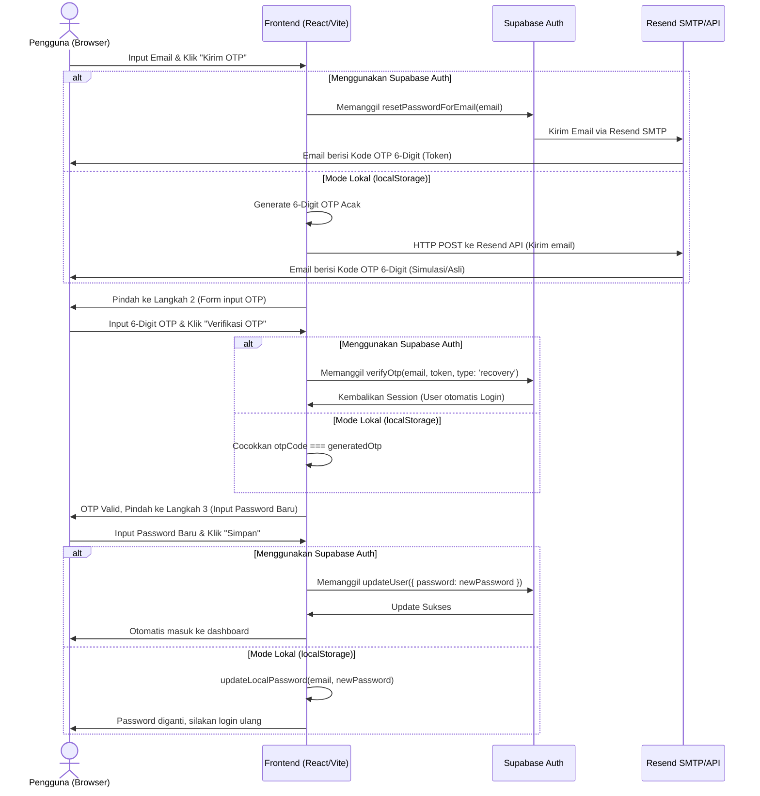

# Panduan Lengkap Integrasi Resend.com, Supabase, dan Vercel

Panduan ini menjelaskan cara mengonfigurasi dan menghubungkan **Resend.com** (sebagai layanan email SMTP/API), **Supabase** (sebagai backend autentikasi), dan **Vercel** (sebagai platform hosting frontend) agar fitur lupa password dengan OTP 6-digit berjalan secara nyata dan aman.

---

## 🛠️ BAGIAN 1: Konfigurasi Resend.com

Resend digunakan untuk mengirim email OTP. Di sini kita akan menyiapkan SMTP credentials dan verifikasi domain.

### 1. Dapatkan SMTP Credentials
1. Buka [Resend.com](https://resend.com) dan buat akun (atau masuk ke akun Anda).
2. Pergi ke menu **Settings** di sebelah kiri, lalu pilih tab **SMTP**.
3. Klik **Create SMTP Service** (jika belum ada).
4. Catat informasi penting berikut untuk digunakan di Supabase nanti:
   * **Host**: `smtp.resend.com`
   * **Port**: `587` (atau `465`)
   * **Username**: `resend`
   * **Password**: *Kata sandi SMTP yang dihasilkan oleh Resend*

### 2. Verifikasi Domain Anda (Agar Bisa Kirim ke Pengguna Umum)
Secara bawaan (mode Sandbox), Resend hanya mengizinkan pengiriman email ke email pemilik akun. Untuk dapat mengirim email ke pengguna umum (gmail, yahoo, dll.):
1. Buka menu **Domains** di sebelah kiri dashboard Resend.
2. Klik **Add Domain**.
3. Masukkan nama domain kustom Anda (misal: `smartwatchindonesia.my.id`).
4. Resend akan memberikan **3 DNS Records** (tipe TXT dan MX) berisi nama (host) dan nilai (value) untuk DKIM dan SPF.
5. Masuk ke panel DNS hosting tempat Anda membeli domain (misal: Cloudflare, Niagahoster, Domainesia, dll.).
6. Tambahkan 3 DNS Record tersebut pada konfigurasi DNS domain Anda.
7. Kembali ke Resend, lalu klik **Verify**. Tunggu beberapa saat hingga statusnya berubah menjadi **Verified**.

### 3. Dapatkan API Key Resend (Untuk Autentikasi API)
1. Pilih menu **API Keys** di sebelah kiri.
2. Klik **Create API Key**. Beri nama (misal: `Vercel Prod Key`), atur permission menjadi **Full Access**.
3. Klik **Add** dan salin kunci API yang muncul (format: `re_xxxxxxxxxxxx`). *Kunci ini hanya akan muncul sekali.*

---

## 🔒 BAGIAN 2: Konfigurasi Supabase Auth (Menghubungkan ke Resend SMTP)

Supabase bertugas mengelola session keamanan dan mereset password. Kita akan menghubungkan Supabase dengan server SMTP Resend agar email Supabase dikirim menggunakan Resend.

### 1. Aktifkan Custom SMTP di Supabase
1. Masuk ke [Supabase Dashboard](https://supabase.com).
2. Pilih proyek **Smartwatch** Anda.
3. Pergi ke **Project Settings** (ikon gerigi di kiri bawah) -> pilih menu **Auth**.
4. Gulir ke bawah hingga Anda menemukan bagian **SMTP Settings** (Custom SMTP Provider).
5. Aktifkan (toggle) **Enable Custom SMTP**.
6. Isi kolom dengan data SMTP yang didapat dari **Resend** (Bagian 1):
   * **Sender Email**: *Masukkan email domain terverifikasi Anda* (misal: `otp@smartwatchindonesia.my.id` atau `onboarding@resend.dev` sebagai fallback).
   * **Sender Name**: `Smartwatch Indonesia`
   * **SMTP Host**: `smtp.resend.com`
   * **SMTP Port**: `587`
   * **SMTP Username**: `resend`
   * **SMTP Password**: *SMTP password yang didapat dari Resend*
7. Klik **Save** di bagian bawah.

### 2. Konfigurasi Template Email "Reset Password" Menjadi Kode OTP 6-Digit
Secara default, Supabase mengirimkan tautan link pemulihan. Untuk mengubahnya menjadi kode OTP 6-digit:
1. Di halaman pengaturan **Auth** Supabase, gulir ke atas ke bagian **Email Templates**.
2. Pilih tab **Reset Password**.
3. Ubah kolom **Message** (Body Email) agar menampilkan token 6-digit. Anda harus menggunakan placeholder `{{ .Token }}`. Contoh isi email:
   ```html
   <h2>Atur Ulang Kata Sandi Smartwatch</h2>
   <p>Halo,</p>
   <p>Gunakan kode OTP berikut untuk mengatur ulang kata sandi akun Anda:</p>
   <div style="font-size: 24px; font-weight: bold; background: #f3f4f6; padding: 10px 20px; display: inline-block; letter-spacing: 4px; border-radius: 6px;">
     {{ .Token }}
   </div>
   <p>Kode ini hanya berlaku selama 5 menit. Jangan bagikan kode ini kepada siapapun.</p>
   ```
4. Klik **Save**.

---

## 🚀 BAGIAN 3: Konfigurasi Vercel (Deployment & Environment)

Vercel menampung frontend React Vite Anda. Kita perlu mendaftarkan semua variabel lingkungan (environment variables) di Vercel agar kode React dapat berkomunikasi dengan Supabase dan Resend API.

### 1. Daftarkan Environment Variables di Vercel
1. Masuk ke akun [Vercel.com](https://vercel.com) dan pilih proyek **Smartwatch** Anda.
2. Klik tab **Settings** di menu atas.
3. Pilih menu **Environment Variables** di kolom sebelah kiri.
4. Tambahkan variabel-variabel berikut:

| Key | Value | Keterangan |
| :--- | :--- | :--- |
| `VITE_SUPABASE_URL` | `https://cegoyvlmyzxgpznyqlos.supabase.co` | URL API Supabase Anda |
| `VITE_SUPABASE_ANON_KEY` | `eyJhbGciOiJIUzI1NiIsInR5c...` | Anon Key Supabase Anda |
| `VITE_RESEND_API_KEY` | `re_xxxxxxxxxxxx` | API Key asli dari Resend.com |
| `VITE_RESEND_FROM_EMAIL` | `Smartwatch OTP <otp@domain-anda.com>` | Email pengirim berdomain terverifikasi |

5. Pastikan centang opsi untuk **Production**, **Preview**, dan **Development**, lalu klik **Save** untuk masing-masing variabel.

### 2. Lakukan Deploy Ulang (Redeploy)
Karena Vite menyisipkan variabel lingkungan ke dalam kode JavaScript pada saat proses kompilasi (Build), Anda harus membangun ulang proyek Anda agar Vercel mendeteksi perubahan ini:
1. Klik tab **Deployments** pada dashboard proyek Vercel Anda.
2. Klik tombol **tiga titik (...)** pada deployment terbaru Anda di daftar.
3. Pilih opsi **Redeploy**.
4. Tunggu hingga proses build selesai (biasanya 1-2 menit).

---

## 🔄 BAGIAN 4: Alur Kerja Sistem di Sisi Pengguna (Frontend React)

Setelah konfigurasi di atas selesai, begini alur yang terjadi di balik layar saat pengguna mereset password:


